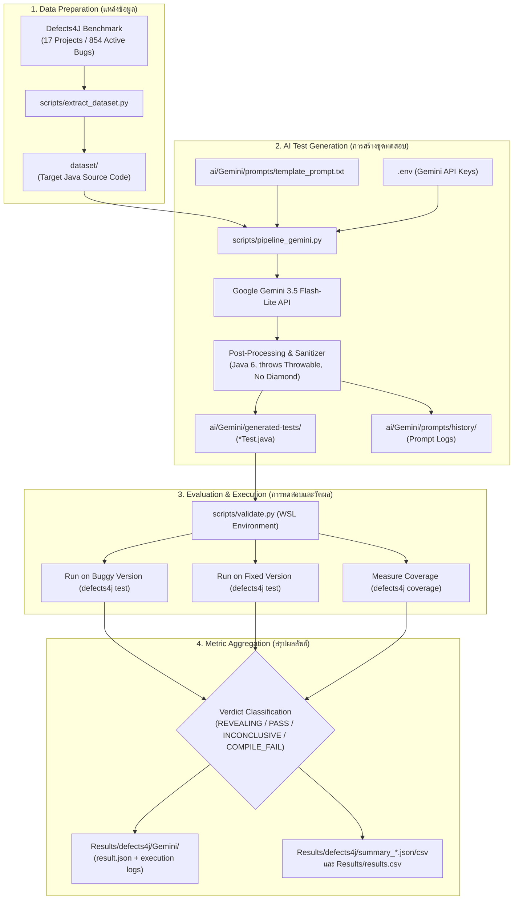

# SQA Pipeline Workflow & Script Guide

เอกสารอธิบาย Flow การทำงานทั้งหมดของระบบ Automated Unit Test Generation (Defects4J + Gemini Engine), รายละเอียดหน้าที่ของแต่ละโมดูล และคู่มือการเรียกใช้สคริปต์ในโฟลเดอร์ `scripts/`

---

## 1. ภาพรวมการไหลของข้อมูล (End-to-End Data Flow)



---

## 2. โครงสร้างไดเรกทอรีของโปรเจกต์ (Project Structure)

```text
SQA_Project_Clean/
├── scripts/                         # [หมวดสคริปต์] รวมเครื่องมือการทำงานทั้งหมด
│   ├── pipeline_gemini.py           # สคริปต์สร้างชุดทดสอบอัตโนมัติด้วย Gemini
│   ├── validate.py                  # สคริปต์รันเทสบน Defects4J และวัดผลคะแนนตาม COMMON_OUTPUT_FORMAT
│   ├── run_all_and_validate.py      # สคริปต์ควบคุมการทำงานอัตโนมัติทั้ง Generate และ Validate
│   ├── summarize_results.py         # สคริปต์แสดงผลตารางสรุปคะแนนทางหน้าจอ Terminal
│   ├── extract_dataset.py           # สคริปต์สกัดโค้ดจาก Defects4J มาลงโฟลเดอร์ dataset/
│   ├── generate_prompt.py           # สคริปต์ทดสอบสร้าง Prompt สำหรับคลาสเดี่ยว
│   └── record_result.py             # สคริปต์บันทึกคะแนนเข้า results.csv
│
├── Results/                         # [หมวดผลลัพธ์] ผลการทดลองและรายงานสรุปทั้งหมด
│   ├── defects4j/                   # ผลลัพธ์มาตรฐานตาม COMMON_OUTPUT_FORMAT
│   │   ├── Gemini/                  # ผลการประเมินรายบั๊ก (<Project>/<Project>-<Bug>/run1/result.json + logs)
│   │   ├── summary_by_project.csv   # สรุปผลแยกตามโปรเจกต์ 17 แถว (Coverage, FDR, Run)
│   │   └── summary_overall.json     # สรุปภาพรวมอัลกอริทึม Gemini (854 บั๊ก, FDR 2.20%)
│   └── results.csv                  # ตารางคะแนนรวม 854 แถว (Coverage & Fault Detection)
│
├── dataset/                         # [หมวดข้อมูลนำเข้า] คลาสเป้าหมาย 854 บั๊ก (ซอร์สโค้ด Java ดิบ)
│   ├── Chart_1/
│   │   └── AbstractCategoryItemRenderer.java
│   └── ...
│
├── ai/                              # [หมวด AI] แม่แบบ Prompt, ประวัติการส่ง, และโค้ดเทสที่สร้าง
│   └── Gemini/
│       ├── prompts/
│       │   ├── template_prompt.txt  # เทมเพลต Prompt กฎเหล็ก Java 6 สำหรับส่งให้ AI
│       │   └── history/             # บันทึกประวัติ Prompt ที่ส่งจริงครบทั้ง 854 บั๊ก
│       └── generated-tests/         # ชุดทดสอบ JUnit 4 (*Test.java) ที่ AI สร้างขึ้น (854 บั๊ก)
│
├── docs/                            # [หมวดเอกสารประกอบ]
│   ├── PIPELINE_WORKFLOW.md         # คู่มือ Flow การทำงานฉบับนี้
│   └── COMMON_OUTPUT_FORMAT.md      # ข้อกำหนดรูปแบบผลลัพธ์มาตรฐานของโครงการ
│
├── .env.example                     # ไฟล์ตัวอย่างตั้งค่า API Key
└── README.md
```

---

## 3. รายละเอียดหน้าที่ของแต่ละส่วน (Component Breakdown)

### 3.1 แหล่งข้อมูลคลาสเป้าหมาย (`dataset/` & `scripts/extract_dataset.py`)
- **ที่มาข้อมูล:** บั๊กจริง 854 ตัวจาก 17 โปรเจกต์ของ Defects4J (เช่น Chart, Cli, Closure, Lang, Math, Mockito, Time ฯลฯ)
- **หน้าที่:**
  - จัดเก็บซอร์สโค้ดของคลาสที่มีบั๊ก (Target Class) แยกเป็นรายโฟลเดอร์ เช่น `dataset/Cli_1/CommandLine.java`
  - สคริปต์ Generator สามารถอ่านชื่อ Package และ Class จากตัวโค้ด Java ได้โดยตรง
  - **ข้อดี:** ผู้ใช้และสมาชิกในกลุ่มทุกคนสามารถเข้าถึงโค้ดได้ทันที โดยไม่ต้องติดตั้งหรือรัน `defects4j checkout` ผ่าน WSL ให้เสียเวลา

### 3.2 ระบบสร้างชุดทดสอบอัตโนมัติ (`scripts/pipeline_gemini.py`)
- **หน้าที่:**
  1. **ประกอบ Prompt:** อ่านเทมเพลตจาก `template_prompt.txt` และแทนที่ตัวแปร `{PACKAGE_NAME}`, `{TEST_CLASS_NAME}`, และ `{TARGET_SOURCE_CODE}` จากโฟลเดอร์ `dataset/`
  2. **เรียก Gemini API:** ส่งไปยังโมเดล `gemini-3.5-flash-lite` พร้อมฟังก์ชัน:
     - **Key Rotation:** สลับ Key สำรองอัตโนมัติเมื่อ Key ปัจจุบันชนโควตารายวัน
     - **Exponential Backoff:** ชะลอเวลาเมื่อติด Rate Limit (HTTP 429)
  3. **Sanitize ไวยากรณ์ Java:**
     - บังคับใช้ไวยากรณ์ Java 6 ดั้งเดิม (ตัด Diamond `<>`, Lambda `->`, Try-with-resources)
     - เติม `throws Throwable` ในทุก `@Test` method
     - จัดการ Boxing สำหรับค่าพิเศษ เช่น `Double.valueOf(Double.NaN)`
  4. **บันทึกผลงาน:**
     - โค้ดเทสถูกเซฟลง `ai/Gemini/generated-tests/<project>_<bug_id>_buggy/`
     - Prompt ที่ส่งจริงถูกบันทึกลง `ai/Gemini/prompts/history/<project>_<bug_id>.txt`

### 3.3 ระบบทดสอบและวัดผลคะแนน (`scripts/validate.py`)
- **หน้าที่:**
  1. บีบอัดชุดทดสอบเป็น `.tar.bz2` แล้วนำไปรันบนสภาพแวดล้อม Defects4J จริงผ่าน WSL
  2. **รันบน Buggy Version (`defects4j test`):** ตรวจสอบว่าเทสคอมไพล์ผ่านไหม และตรวจจับข้อผิดพลาดเจอหรือไม่ (Failing Tests)
  3. **รันบน Fixed Version (`defects4j test`):** ตรวจสอบว่าเทสเดียวกันนี้รันผ่านบนเวอร์ชันที่แก้บั๊กแล้วหรือไม่
  4. **วัด Code Coverage (`defects4j coverage`):** วัดความครอบคลุมของบรรทัด (Line Coverage) และเงื่อนไข (Branch Coverage)
  5. **จำแนกผลการทดสอบ (Verdict & Status):**
     - **`REVEALING` (เป้าหมายสูงสุด):** เทสตกบน Buggy แต่ผ่านบน Fixed (`status = "complete"`, `fault_detected = true`)
     - **`NOT_REVEALING`:** เทสรันผ่านทั้งสองเวอร์ชัน (`status = "complete"`, `fault_detected = false`)
     - **`INCONCLUSIVE`:** เทสตกทั้งสองเวอร์ชัน (`status = "complete"`, `fault_detected = null`)
     - **`VALIDATION_FAILED`:** เทสคอมไพล์ไม่ผ่านบน Java 6 / Defects4J (`status = "validation_failed"`)

### 3.4 การรวบรวมผลลัพธ์ (`Results/defects4j/` และ `Results/results.csv`)
- **ระดับรายตัว:** เก็บรายงานสถานะ `result.json` และโฟลเดอร์ `logs/` ตามรูปแบบ `COMMON_OUTPUT_FORMAT` ไว้ที่ `Results/defects4j/Gemini/<Project>/<Project>-<BugID>/run1/`
- **ระดับภาพรวม:** รวมผลเป็นตาราง `Results/defects4j/summary_by_project.csv` และ `Results/defects4j/summary_overall.json` รวมถึงตาราง `Results/results.csv` เพื่อนำไปวิเคราะห์ทางสถิติและเปรียบเทียบกับวิธีอื่น

---

## 4. คู่มือการใช้งานสำหรับสมาชิกในทีม (Usage Guide)

### 4.1 การเตรียมความพร้อม (Prerequisites)
1. ติดตั้ง Python 3.10+
2. ติดตั้ง Dependencies:
   ```bash
   pip install google-generativeai python-dotenv
   ```
3. สร้างไฟล์ `.env` ที่โฟลเดอร์ Root ของโปรเจกต์ (คัดลอกจาก `.env.example`):
   ```env
   GEMINI_API_KEY=AIzaSy...your_active_key...
   #GEMINI_API_KEY=AIzaSy...your_backup_key_1...
   #GEMINI_API_KEY=AIzaSy...your_backup_key_2...
   ```

### 4.2 การรัน Test Generator (`scripts/pipeline_gemini.py`)
สามารถรันได้ทันทีบนทุกระบบปฏิบัติการ (Windows, Mac, Linux) โดยไม่ต้องติดตั้ง Defects4J:
```bash
# ทดลองรันเฉพาะบางโปรเจกต์ (เช่น Lang 5 ตัวแรก)
python scripts/pipeline_gemini.py --projects Lang --limit 5

# รันเจาะจงบั๊กที่ต้องการ
python scripts/pipeline_gemini.py --projects Cli --bugs 1 2 3

# รันทุกโปรเจกต์และทุกบั๊ก (854 บั๊ก)
python scripts/pipeline_gemini.py --all
```

### 4.3 การรัน Validation (`scripts/validate.py`)
ขั้นตอนการวัดผลจำเป็นต้องมี Defects4J ติดตั้งใน WSL/Ubuntu (หรือรัน dry-run / collect-only บน Windows ได้ทันที):
```bash
# รันวัดผลเฉพาะโปรเจกต์ที่ต้องการ
python scripts/validate.py --projects Lang

# รวบรวมสรุปผลลัพธ์ทั้งหมดเป็น summary_by_project.csv และ summary_overall.json (ไม่ต้องรันเทสซ้ำ)
python scripts/validate.py --collect-only

# แสดงผลสรุปบนหน้าจอ Terminal
python scripts/summarize_results.py
```