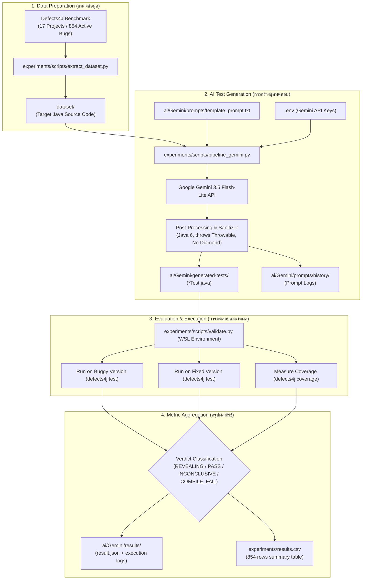

# SQA Pipeline Workflow & Git Guide

เอกสารอธิบาย Flow การทำงานทั้งหมดของระบบ Automated Unit Test Generation (Defects4J + Gemini Engine), รายละเอียดหน้าที่ของแต่ละโมดูล และคู่มือการใช้งาน Git Repository

---

## 1. ภาพรวมการไหลของข้อมูล (End-to-End Data Flow)



---

## 2. โครงสร้างไดเรกทอรีของโปรเจกต์ (Project Structure)

```text
SQA_Project/
├── dataset/                         # ชุดข้อมูลคลาสเป้าหมาย 854 บั๊ก (ซอร์สโค้ด Java ดิบ)
│   ├── Chart_1/
│   │   └── AbstractCategoryItemRenderer.java
│   └── ...
│
├── ai/
│   └── Gemini/
│       ├── prompts/
│       │   ├── template_prompt.txt  # เทมเพลต Prompt กฎเหล็ก Java 6 สำหรับส่งให้ AI
│       │   └── history/             # บันทึกประวัติ Prompt ที่ส่งจริงครบทั้ง 854 บั๊ก
│       ├── generated-tests/         # ชุดทดสอบ JUnit 4 (*Test.java) ที่ AI สร้างขึ้น
│       └── results/                 # ผลการประเมินรายบั๊ก (result.json และ logs)
│
├── experiments/
│   ├── scripts/
│   │   ├── extract_dataset.py       # สคริปต์สกัดโค้ดจาก Defects4J มาลงโฟลเดอร์ dataset/
│   │   ├── pipeline_gemini.py       # สคริปต์สร้างชุดทดสอบอัตโนมัติด้วย Gemini
│   │   └── validate.py              # สคริปต์รันเทสบน Defects4J และวัดผลคะแนน
│   ├── raw/                         # สำเนาไฟล์ผลลัพธ์ดิบ
│   └── results.csv                  # ตารางคะแนนรวม 854 แถว (Coverage & Fault Detection)
│
└── README.md
```

---

## 3. รายละเอียดหน้าที่ของแต่ละส่วน (Component Breakdown)

### 3.1 แหล่งข้อมูลคลาสเป้าหมาย (`dataset/` & `extract_dataset.py`)
- **ที่มาข้อมูล:** บั๊กจริง 854 ตัวจาก 17 โปรเจกต์ของ Defects4J (เช่น Chart, Cli, Closure, Lang, Math, Mockito, Time ฯลฯ)
- **หน้าที่:**
  - จัดเก็บซอร์สโค้ดของคลาสที่มีบั๊ก (Target Class) แยกเป็นรายโฟลเดอร์ เช่น `dataset/Cli_1/CommandLine.java`
  - สคริปต์ Generator สามารถอ่านชื่อ Package และ Class จากตัวโค้ด Java ได้โดยตรง
  - **ข้อดี:** ผู้ใช้และสมาชิกในกลุ่มทุกคนสามารถเข้าถึงโค้ดได้ทันที โดยไม่ต้องติดตั้งหรือรัน `defects4j checkout` ผ่าน WSL ให้เสียเวลา

### 3.2 ระบบสร้างชุดทดสอบอัตโนมัติ (`pipeline_gemini.py`)
- **หน้าที่:**
  1. **ประกอบ Prompt:** อ่านเทมเพลตจาก `template_prompt.txt` และแทนที่ตัวแปร `{PACKAGE_NAME}`, `{TEST_CLASS_NAME}`, และ `{TARGET_SOURCE_CODE}` จากโฟลเดอร์ `dataset/`
  2. **เรียก Gemini API:** ส่งไปยังโมเดล `gemini-3.5-flash-lite` พร้อมฟังก์ชัน:
     - **Key Rotation:** สลับ Key สำรองอัตโนมัติเมื่อ Key ปัจจุบันชนโควตารายวัน
     - **Exponential Backoff:** ชะลอเวลาเมื่อติด Rate Limit (HTTP 429)
  3. **Sanitize ไวยากรณ์ Java:**
     - บังคับใช้ไวยากรณ์ Java 6 ดั้งเดิม (ตัด Diamond `<>`, Lambda `->`, Try-with-resources)
     - เติม `throws Throwable` ในทุก `@Test` method
     - จัดการ Boxing สำหรับค่าพิเศษ เช่น `Double.valueOf(Double.NaN)`
  4. **บันทึกผลงาน:**
     - โค้ดเทสถูกเซฟลง `ai/Gemini/generated-tests/<project>_<bug_id>_buggy/`
     - Prompt ที่ส่งจริงถูกบันทึกลง `ai/Gemini/prompts/history/<project>_<bug_id>.txt`

### 3.3 ระบบทดสอบและวัดผลคะแนน (`validate.py`)
- **หน้าที่:**
  1. บีบอัดชุดทดสอบเป็น `.tar.bz2` แล้วนำไปรันบนสภาพแวดล้อม Defects4J จริงผ่าน WSL
  2. **รันบน Buggy Version (`defects4j test`):** ตรวจสอบว่าเทสคอมไพล์ผ่านไหม และตรวจจับข้อผิดพลาดเจอหรือไม่ (Failing Tests)
  3. **รันบน Fixed Version (`defects4j test`):** ตรวจสอบว่าเทสเดียวกันนี้รันผ่านบนเวอร์ชันที่แก้บั๊กแล้วหรือไม่
  4. **วัด Code Coverage (`defects4j coverage`):** วัดความครอบคลุมของบรรทัด (Line Coverage) และเงื่อนไข (Branch Coverage)
  5. **จำแนกผลการทดสอบ (Verdict):**
     - **`REVEALING` (เป้าหมายสูงสุด):** เทสตกบน Buggy แต่ผ่านบน Fixed แสดงว่าจับบั๊กจริงได้สำเร็จ
     - **`PASS`:** เทสรันผ่านทั้งสองเวอร์ชัน (คอมไพล์ผ่าน มี Coverage แต่ยังไม่กระตุ้นให้เกิด Bug)
     - **`INCONCLUSIVE`:** เทสตกทั้งสองเวอร์ชัน (Assertion เปราะบางหรือมีข้อผิดพลาด)
     - **`COMPILE_FAIL`:** เทสคอมไพล์ไม่ผ่านบน Java 6 / Defects4J

### 3.4 การรวบรวมผลลัพธ์ (`ai/Gemini/results/` และ `experiments/results.csv`)
- **ระดับรายตัว:** เก็บรายงานสถานะ `result.json`, `buggy_test.log`, `fixed_test.log`, และ `buggy_coverage.log` ไว้เป็นหลักฐานตรวจสอบย้อนหลัง
- **ระดับภาพรวม:** รวมผลเป็นตาราง `experiments/results.csv` ทั้งหมด 854 แถว เพื่อนำไปวิเคราะห์ทางสถิติและเปรียบเทียบกับ Claude, DE และ ACO

---

## 4. คู่มือการใช้งานสำหรับสมาชิกในทีม (Usage Guide)

### 4.1 การเตรียมความพร้อม (Prerequisites)
1. ติดตั้ง Python 3.10+
2. ติดตั้ง Dependencies:
   ```bash
   pip install google-generativeai python-dotenv
   ```
3. สร้างไฟล์ `.env` ที่โฟลเดอร์ Root ของโปรเจกต์:
   ```env
   GEMINI_API_KEY=AIzaSy...your_active_key...
   #GEMINI_API_KEY=AIzaSy...your_backup_key_1...
   #GEMINI_API_KEY=AIzaSy...your_backup_key_2...
   ```

### 4.2 การรัน Test Generator (`pipeline_gemini.py`)
สามารถรันได้ทันทีบนทุกระบบปฏิบัติการ (Windows, Mac, Linux) โดยไม่ต้องติดตั้ง Defects4J:
```bash
# ทดลองรันเฉพาะบางโปรเจกต์ (เช่น Lang 5 ตัวแรก)
python experiments/scripts/pipeline_gemini.py --projects Lang --limit 5

# รันเจาะจงบั๊กที่ต้องการ
python experiments/scripts/pipeline_gemini.py --projects Cli --bugs 1 2 3

# รันทุกโปรเจกต์และทุกบั๊ก (854 บั๊ก)
python experiments/scripts/pipeline_gemini.py --all
```

### 4.3 การรัน Validation (`validate.py`)
ขั้นตอนการวัดผลจำเป็นต้องมี Defects4J ติดตั้งใน WSL/Ubuntu:
```bash
# ทดสอบเฉพาะโปรเจกต์ที่ต้องการ
python experiments/scripts/validate.py --projects Lang --test-dir ai/Gemini/generated-tests --result-dir ai/Gemini/results

# รวมผลลัพธ์เป็นตาราง CSV โดยไม่ต้องรันเทสซ้ำ
python experiments/scripts/validate.py --collect-only
```